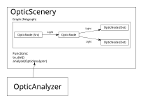
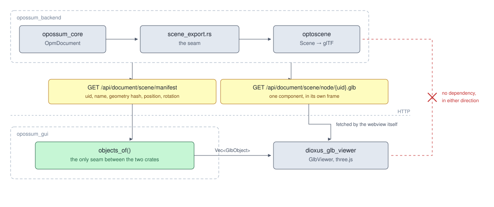

# Software architecture

This chapter discusses the overall software structure of the OPOSSUM system.

In the first version, we want to concentrate on a framework providing the necessary entities (i.e. structs and traits) in order to model optical systems as [previously described](./optical_model.md). This system would simply require a `main` function calling the necessary structs. For better debugging purposes, we should already implement an export system to the `graphviz` package (dot-files) for visualization of the graph structures.

In a further step, a command line tool should be developed to accept a data file containing the model. This requires a proper serialization / deserialization system to be implemented. For this, we would propose a very well-established standard crate `serde` which can then read and write data in various formats such as JSON or YAML.

For future extension steps, the possibilities of modular design should be investigated in detail. This approach helps to keep the basic framework simple and might improve the integration of external code contributions. Hence, the possibilities of a plugin architecture should be considered.

### How OPPUSUM  works?
The OPPOSUM core library is the 'brain' of the system.
It contains all optical functionalities and calculation tools.
Depending on how you would like to proceed, there are two main ways of talking to this brain.

1. The GUI (Graphical User Interface) frontend is designed to be more user-friendly and visual.
When you click a button in the GUI, it sends the message over HTTP (Hypertext Transfer Protocol) to our backend server.
The server then asks the core library to run the input data and shows you the results instantly.

The backend server is the bridge; it not only transfers the data from the GUI to the core library,
but it can also be connected to large industrial machines.

2. CLI (Command Line Interface). It is a direct door to the core library.
Because the CLI works with the `Rust` programming language, it talks directly to the core library
without needing a server in the middle.

## How a model becomes a picture

The 3D view is a good example of the above in miniature, and of one rule worth stating explicitly.

The geometry comes from `opossum_core`, which knows the shape of every component. The file format
comes from `optoscene`, a small export crate that knows glTF and nothing about optics. The drawing is
done by `dioxus_glb_viewer`, a viewer component that knows three.js and nothing about optics either.

**The two export crates know nothing about each other, and that is deliberate.** `optoscene` never
mentions a viewer, `dioxus_glb_viewer` never mentions a scene, and neither depends on the other in
either direction. Everything that translates one into the other sits in one function in the GUI. Each
crate is therefore replaceable on its own, and each is useful outside OPOSSUM.

Two endpoints rather than one is what keeps a live view cheap. The manifest is small and is refetched
whenever the model changes; it says which components exist, what each one looks like as a hash, and
where it sits. A component's geometry is fetched separately, and only when that hash says its shape
really changed. Moving a lens therefore costs a new position and no geometry at all.

`optoscene` does bring a streaming protocol of its own, which computes the minimal set of update
messages between two scenes. OPOSSUM does not use it. The viewer already performs the same kind of
comparison on the object list it is handed, at the same granularity, so decoding those messages would
only rebuild a list the viewer then diffs a second time. The feature stays switched off on purpose —
it is not an oversight.
