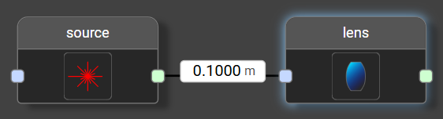
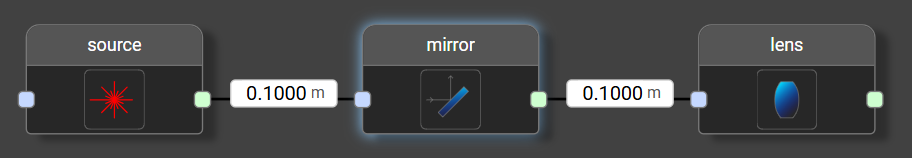
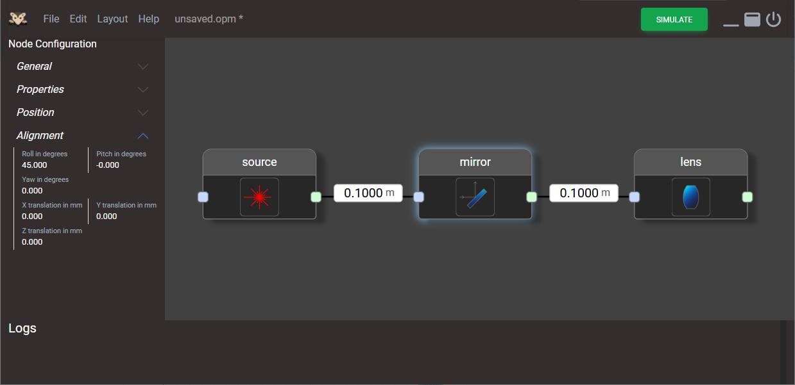

# Model Geometry

When modeling an optical system, the precise location and alignment of optical nodes in 3D space are critical. This section illustrates how OPOSSUM handles geometry.

## General Concept

In contrast to other optical design software, OPOSSUM aims for a geometry model that is simple and covers 95% of typical situations encountered in a laser laboratory, while still making the remaining 5% possible to model.

In daily practice, the relative position of optical components to one another is often more important than their absolute global coordinates. Therefore, OPOSSUM simplifies system modeling by allowing you to define the geometric distance between components along the *optical axis*.

### The Optical Axis

Many optical design tools avoid the concept of an "optical axis" because, physically, no single ray path should be treated differently from others. OPOSSUM respects this: during the actual simulation run, all rays are treated equally.

However, before the simulation begins, OPOSSUM performs a *Component Alignment* step. It is during this layout phase that the concept of an optical axis becomes extremely useful.

Strictly speaking, there is no single, stringent definition of an optical axis—especially for non-rotationally symmetric components, where it can be a matter of definition. Nevertheless, this concept works exceptionally well for most standard setups.

### Component Placement

Although relative positioning is key, every system needs a defined starting point. By default, the `Source` node is placed at the global coordinate origin `(0, 0, 0)`. All subsequent nodes are placed relative to this point.

During the component alignment run, OPOSSUM traces a reference ray along the optical axis. By default, this starts at the center of the `Source` and propagates (usually along the Z-axis) by the distance specified in the connection to the next node.

Consider the following diagram:

In this example:

* The **Source** is placed at `(0mm, 0mm, 0mm)`.
* The **Lens** is placed at `(0mm, 0mm, 100mm)`.

Crucially, the optical axis follows physical laws regarding reflection and refraction. For example, if we place a mirror in the beamline:

The situation is as follows:

1. The **Source** is at `(0mm, 0mm, 0mm)`.
2. The **Mirror** is placed at `(0mm, 0mm, 100mm)`.

By default, a mirror node has an alignment of 0°. This means the light (and thus the optical axis) is reflected directly back towards the source. If a lens is connected after the mirror with a distance of 100 mm, it is placed along this *reflected* optical axis. Consequently, the lens would land back at `(0mm, 0mm, 0mm)`, facing the opposite direction.

To model a 90° beam deflection, the mirror must be rotated. This is done in the `Node Editor` panel under the `Alignment` section. For a 90° turn, set the **Roll Angle** (rotation around the X-axis) to **45°**.

With this setting, the components are placed as follows:

| Component | Position            |
|-----------|---------------------|
| Source    | (0mm, 0mm, 0mm)     |
| Mirror    | (0mm, 0mm, 100mm)   |
| Lens      | (0mm, 100mm, 100mm) |

### Anchor point

We have just discussed how a component is placed at a certain position. This description is actually a bit unprecise since an optical component is not a point-like object but has a finite size. Hence we clarify here that each optical component has an *anchor point* which is normally the center of the incoming surface. This is described in the [reference](../reference/reference.md) section for each particular node type. In the above mentioned `Alignment` setting the component is turned around this point. Furthermore, a component can be shifted (e.g. for modeling a shifted lens) along all axes.

### Absolute placement
