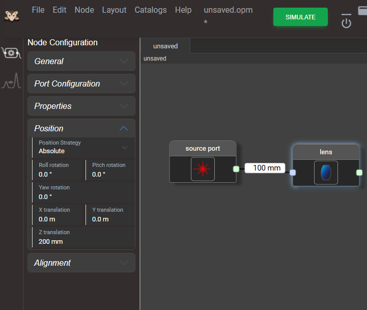
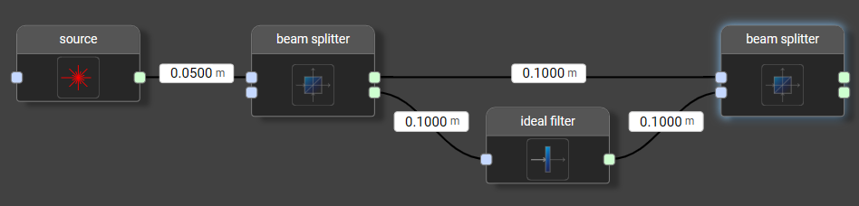
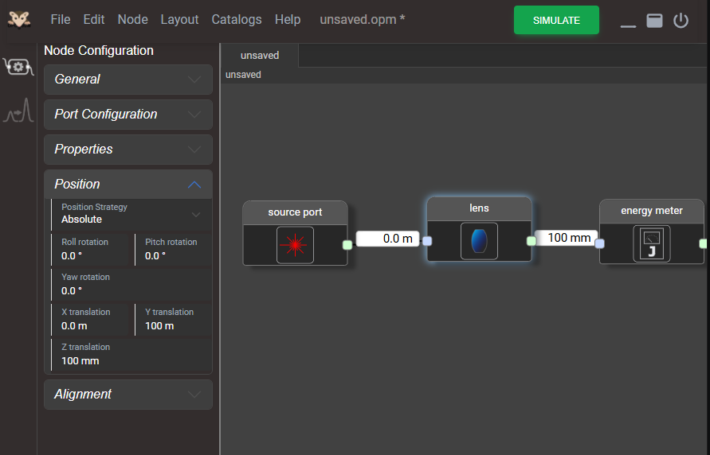

# Model Geometry

When modeling an optical system, the precise location and alignment of optical nodes in 3D space are critical. This section illustrates how OPOSSUM handles geometry.

## General Concept

In contrast to other optical design software, OPOSSUM aims for a geometry model that is simple and covers 95% of typical situations encountered in a laser laboratory, while still making the remaining 5% possible to model.

In daily practice, the relative position of optical components to one another is often more important than their absolute global coordinates. Therefore, OPOSSUM simplifies system modeling by allowing you to define the geometric distance between components along the *optical axis*.

### The Optical Axis

Many optical design tools avoid the concept of an "optical axis" because, physically, no single ray path should be treated differently from others. OPOSSUM respects this: during the actual simulation run, all rays are treated equally.

However, before the simulation begins, OPOSSUM performs a *Component Alignment* step. It is during this layout phase that the concept of an optical axis becomes extremely useful.

Strictly speaking, there is no single, stringent definition of an optical axis—especially for non-rotationally symmetric components, where it can be a matter of definition. Nevertheless, this concept works exceptionally well for most standard setups.

### Component Placement

Although relative positioning is key, every system needs a defined starting point. By default, the `Sourceport` node is placed at the global coordinate origin `(0, 0, 0)`. All subsequent nodes are placed relative to this point.

During the component alignment run, OPOSSUM traces a reference ray along the optical axis. By default, this starts at the center of the `Sourceport` and propagates (usually along the Z-axis) by the distance specified in the connection to the next node.

Consider the following diagram:

In this example:

* The **Source port** is placed at `(0mm, 0mm, 0mm)`.
* The **Lens** is placed at `(0mm, 0mm, 100mm)`.

Crucially, the optical axis follows physical laws regarding reflection and refraction. For example, if we place a mirror in the beamline:

The situation is as follows:

1. The **Source port** is at `(0mm, 0mm, 0mm)`.
2. The **Mirror** is placed at `(0mm, 0mm, 100mm)`.

By default, a mirror node has an alignment of 0°. This means the light (and thus the optical axis) is reflected directly back towards the source. If a lens is connected after the mirror with a distance of 100 mm, it is placed along this *reflected* optical axis. Consequently, the lens would land back at `(0mm, 0mm, 0mm)`, facing the opposite direction.

To model a 90° beam deflection, the mirror must be rotated. This is done in the `Node Editor` panel under the `Alignment` section. For a 90° turn, set the **Roll Angle** (rotation around the X-axis) to **45°**.

With this setting, the components are placed as follows:

| Component | Position            |
|-----------|---------------------|
| Source    | (0mm, 0mm, 0mm)     |
| Mirror    | (0mm, 0mm, 100mm)   |
| Lens      | (0mm, 100mm, 100mm) |

### Anchor point

We have just discussed how a component is placed at a certain position. This description is actually a bit unprecise since an optical component is not a point-like object but has a finite size. Hence we clarify here that each optical component has an *anchor point* which is normally the center of the incoming surface. This is described in the [reference](../reference/reference.md) section for each particular node type. In the above mentioned `Alignment` setting the component is turned around this point. Furthermore, a component can be shifted (e.g. for modeling a shifted lens) along all axes.

### Absolute Placement

While OPOSSUM primarily uses relative positioning, certain scenarios require placing a component at a specific coordinate in the global system. This is achieved using the `Position` property of an optical node.

Consider the following example:

In this model:

1. The `Sourceport` is at the origin `(0, 0, 0)` by default.
2. The `Lens` has its `Position` property set to `absolute` with explicit coordinates `(0mm, 0mm, 200mm)`.

**Behavior:**
When a component is set to `absolute`, OPOSSUM places it at the defined coordinates and skips the relative positioning calculation for that specific node.

> **Important Caveat:** When using absolute placement, the distance value specified in the connection *before* the component is **completely ignored**.

## Pitfalls of Relative Positioning

While relative positioning is convenient, it can lead to geometric inconsistencies in complex setups. Below are common edge cases to watch for.

### Beam Combiners and Parallel Paths

Issues often arise when combining parallel beam paths of unequal lengths, such as in a Mach-Zehnder interferometer setup.

**The Scenario:**

* The beam splits into two arms.
* **Arm 1 (Straight):** Total distance to the combiner is **100 mm**.
* **Arm 2 (Lower):** Due to the additional component, the total distance is **200 mm**.

**The Conflict:**
OPOSSUM must decide where to place the Beam Combiner in 3D space. The logic is as follows:

1. **First Pass:** OPOSSUM traces the first arm and places the Beam Combiner at 100 mm.
2. **Second Pass:** OPOSSUM traces the second arm. Since the Combiner is already placed, it cannot be moved.
3. **Validation:** The software checks if the second arm's geometry is consistent with the existing placement. Since 200 mm $\neq$ 100 mm, the validation fails.

**Result:** OPOSSUM retains the position from the first path and issues a **warning**. You must manually verify warnings in split-path setups.

### Misaligned Absolute Components

Care must be taken when mixing absolute positioning with the optical axis logic.

**The Scenario:**

* The `Sourceport` emits along the Z-axis.
* An absolute `Lens` is placed at `(0mm, 100mm, 100mm)`—offset by 100mm in the Y-direction.

**The Consequence:**
The reference ray (optical axis) travels straight from the source. Because the lens is physically located outside this path, the ray misses the lens entirely.

* The optical axis is "lost" at this point.
* Any downstream components (e.g., the `Energy meter`) cannot be placed and will be excluded from the simulation.

### Multi-pass and Reference Nodes

**Reference nodes** are used to represent a component that already exists elsewhere in the model (common in multi-pass amplifiers or ring cavities).

**Behavior:**

1. **Original Node:** During the positioning run, the "real" node is placed normally.
2. **Reference Node:** When the reference node is encountered, OPOSSUM attempts to route the beam back to the location of the "real" node.
3. **Conflict Check:** Similar to the Beam Combiner scenario, if the calculated optical path does not align perfectly with the "real" node's existing position, the placement fails, and a warning is issued.
