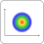

# Fluence detector

## Analysis

As a detector node, incoming light data is simply passed unmodified through the node. However, possible apodization due to input or output port apertures might occur.

## Ports

`input_1`
: Input port.

`output_1`
: Light ouput. This port delivers a copy of the light data from the port `input_1`.

## Properties

`fluence estimator`
: The algorithm used to estimate the fluence. Currently there are the following options:

- Voronoi:
- KDE:
- Binning:
- HelperRays:
