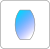

# Spherical lens

This element represents a "real" lens with spherical front and back surfaces. Furthermore, the lens consists of an optical material, which carries the refractive index model among other data. The `center thickness` denotes the distance of the front and back surfaces at symmetry axis of the lens.

Besides the usual aperture definitions of the `front` and `back` surfaces, a lens might limit the aperture additionally if the front and back surfaces intersect. E.g. this is always the case for a biconvex lens. In this case, rays outside this intersection circle are clipped.

Since this element encloses a volume of material, it can be operated as an amplifier: a [pump scenario](../pump_scenarios.md) assigns it a gain model, and light travelling through the medium is amplified accordingly. Without such an assignment the lens is the passive component described here.

## Analysis

- Energy Analysis

    During energy analysis, besides the common behaviour, this element does not alter the incoming the incoming light.
    The output is a copy of the input light. Above mentioned apertures are ignored.

- Ray tracing Analysis

    During ray tracing analysis, incoming rays are refracted on the `front`surface according to Snellius' law of refraction.
    Inside the lens the ray propagate within the given medium. On the `rear`surface, the rays are again refracted.

- Ghost focus Analysis

    During this analysis, the lens behaves similar to the ray tracing analysis.

## Ports

- `input_1`

    Input port. Corresponds to the `front`surface of the lens.

- `output_1`

    Light ouput. This port represents the light having passed the `rear` surface of the lens.

## Properties

- `front curvature`

    Radius of curvature of the `front` surface. This value must not be zero. A positive value denotes a convex surface.
    The value `infinity` or `-infinity` denotes a flat surface.

- `rear curvature`

    Radius of curvature of the `rear` surface. This value must not be zero. A positive value denotes a concave surface.
    The value `infinity` or `-infinity` denotes a flat surface.

- `center thickness`

    Thickness of the lens center at its symmetry axis. This value must be positive and finite.

- `material`

    The (glass-) material the lens is made of. It carries the refractive index model — a constant
    value or a dispersion formula such as Sellmeier or Schott — which is what the refraction at both
    surfaces is calculated from.

- `clear aperture`

    Transversal extent of the lens: the size the material is actually available in, the figure a
    supplier quotes next to the curvatures and the thickness. Defaults to a circle of 12.5 mm radius,
    i.e. the usual 1 inch mount.

    Not to be confused with the aperture of a port: a port aperture states how much light a surface
    transmits where, while the clear aperture states where the material ends. Putting a pinhole in
    front of a lens does not make the lens smaller.
