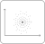

# Spot diagram

## Analysis

As a detector node, incoming light data is passed unmodified through the node; only a port aperture can mask it. In a ray tracing or ghost focus analysis, the node records only the light within its `clear aperture`: light outside a set window passes on unrecorded, and the log and the report warn about it.

## Ports

`input_1`
: Input port.

`output_1`
: Light ouput. This port delivers a copy of the light data from the port `input_1`.

## Properties

`plot aperture`
: Boolean value. Outline the recording window (`clear aperture`, if one is set) and the aperture of the `input_1` port (if one is set) in the plot. Defaults to `false`.

`clear aperture`
: The window the spot diagram records within, unbounded (`Open`) by default. Any shape with an edge can be set instead, e.g. the size of a camera chip; `Open` restores the unbounded window. If the optical axis misses a set window during the alignment run, a warning says that the measurement may fail (see [Clear aperture and port apertures](../nodes.md#clear-aperture-and-port-apertures)).
