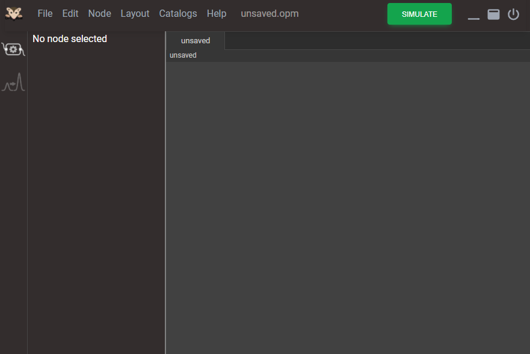
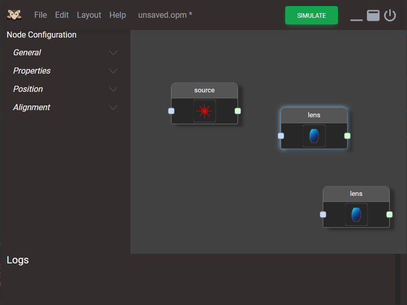
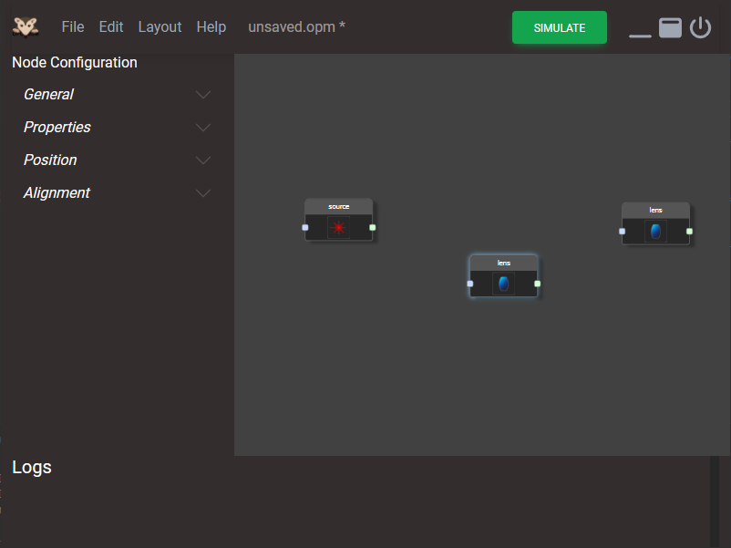
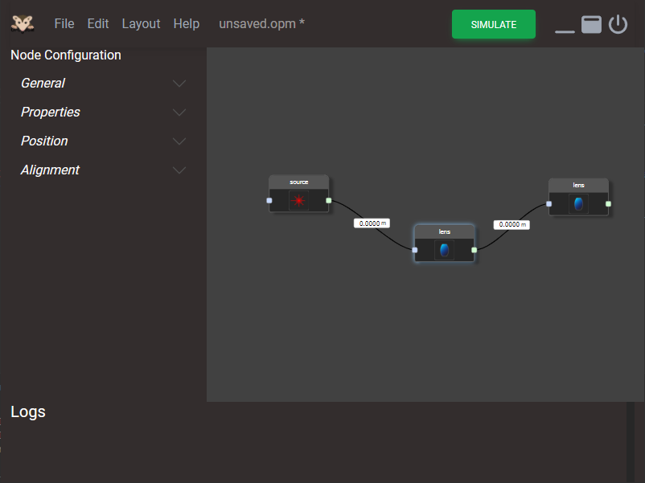
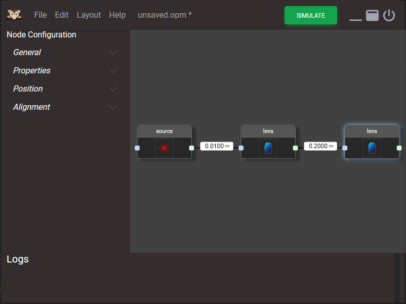
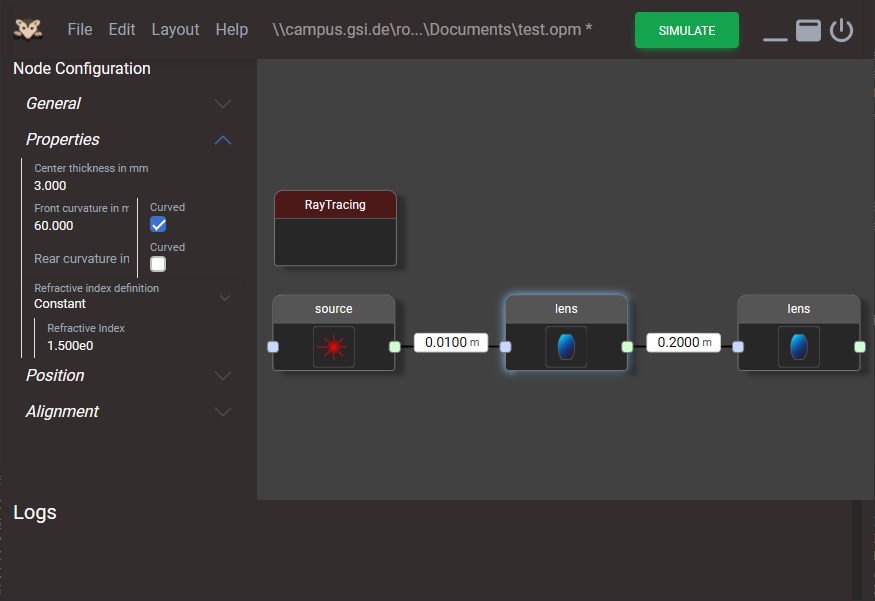
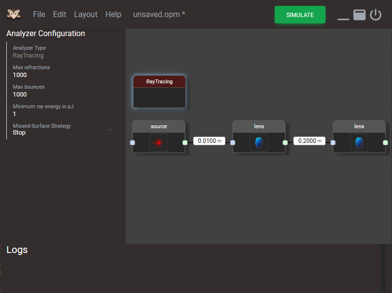
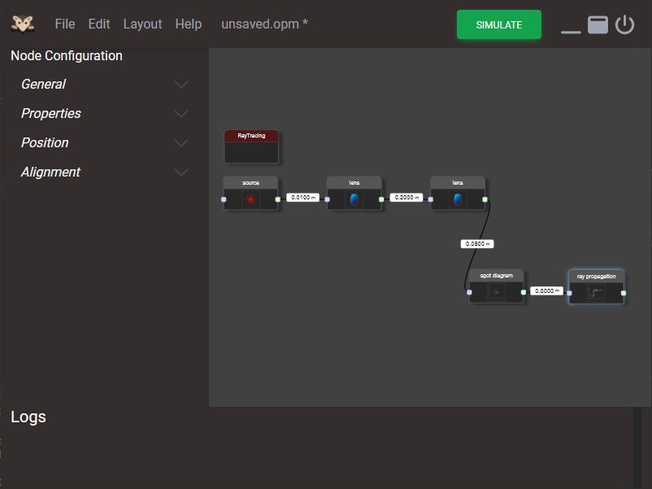
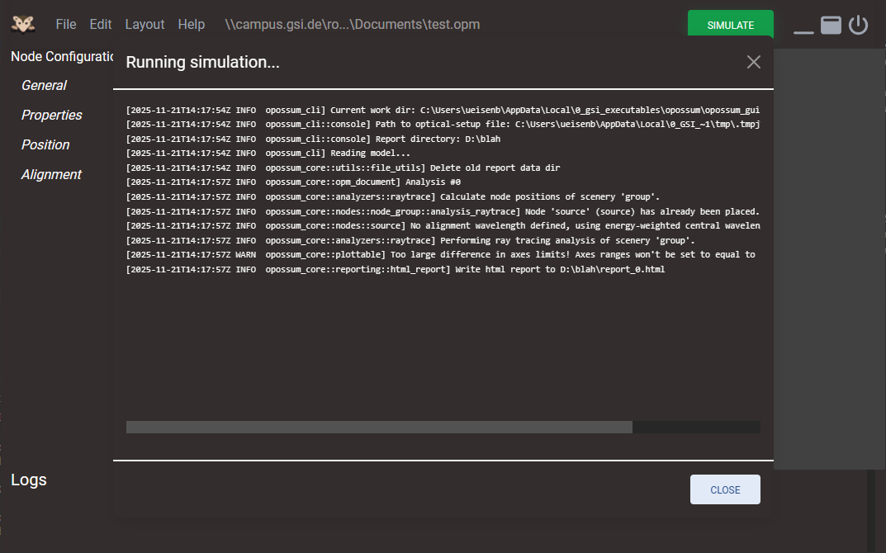

# Usage

The following section describes the usage of the OPOSSUM suite through the graphical user interface (GUI).

## Starting the GUI

In the following we will assume that the software has been installed through one ot the onstallers for the specific platform.

### Windows

On the windows platform, both the MSI and the EXE installers provide an entry in the start menu and a desktop icon `Opossum_GUI`.

### Linux

For Linux it depends on the type of the installation package. Debian and Redhat packages (`.deb` & `.rpm`) install an icon in the menu system. Furthermore, the OPOSSUM GUI
can be started directly on the command line:

```bash
opossum_gui
```

For the AppImage package you can directly execute the package itself by double clicking on the file in the file manager or through the command line e.g.:

```bash
OpossumGui-0.7.0.AppImage
```

Starting the GUI leads to this window to appear:



## First steps

The top menu bar shows the typical menu entries for file handling and the window buttons on the right side. We recommended to use the GUI with a maximized window in order
to have enough space on the canvas to model your optical system.

### Adding an optical node and using the canvas

Using the `Edit` menu we can add either an optic node or an analyzer node. Let us first select an optical node. We start with a `Source` node representing the start of our
optical system.

After selecting, the source node appears on the canvas. The node can be moved on the canvas by simply clicking and dragging it. Let's add two additional `Lens` nodes and place them on the canvas.



The canvas istself is (almost) infinitely large. The view port can be moved by clicking and dragging on the canvs itself. Furthmore, the view port can be zoomed in an out using the mouse wheel.



### Connecting nodes

In order to form an optical network, the nodes have to be connected. This can simply be achieved by clicking on an output port of a node (the light green square on the right side of a node) and drag a line to the input port of another node. Do this now in the order `Source -> Lens -> Lens`. It should look similar to this screen:



Each connection contains a numeric entry which defines the spatial seperation between two connected nodes. Here, it corresponds to the distance of the elements on the optical axis. For an in-depth discussion, how optical elements can be placed, check the [concepts](../concepts/concepts.md) section. For now, we choose a distance of 10 mm between the source and the first lens and 200 mm between both lenses.

One can clean up the layout of the nodes with an auto layout function: Select `Auto Layout` fron the `Layout` menu or press `Ctrl + Shift + A`. You should end up with a screen similar to:



### Configure nodes

Now that we have set up or optical system we must define the parameters of each component. For this tutorial we keep it simple and only configure the most important parameters.
We start with the first lens. Click the first lens node, such that it is highlighted. The properties of this lens are displayed on the left side in the `Node Eitor` panel. Depending on the node type it consists of different (collapsed) sections. For now we will only concentrate on the `Properties` section. It shows the center thickness of the lens as well as the front and back radii of curvature. Select a center thickness of 3mm. A front radius curvature of 60 mm and a plane back surface by clicking the check box. The refractive index remains at 1.5. Hence we configured it as a convex-plano lens.



Repeat this step with the second lens. Use again 3 mm as center thickness, front surface flat, back surface -40 mm. Then select the source node and configure the spectral
properties of the simulated rays: Select `Properties -> Light definition -> Spectral distribution`. Then change the field `Rays spectral disribution` from "Gaussian" to 
"Laser Lines". This setting generates a source emitting rays with exactly one wavelength (1054 nm by default).

### Adding an analyzer

While our optical setup is (almost) finished, we have to define, what kind of analysis should be performed during the simulation. For this, we have to select an analyzer node.
Simply select `Add Analyzer` from the `Edit` menu and choose "RayTracing". As the name says, this will perform a ray tracing calculation. An analyzer can also be configured as shown on the left panel. For this tutorial, we simply keep the default values.



### Adding detector nodes

In princle we are all set to start a simulation...but we won't get almost no output. Why? Well, we did not specify any *detector nodes*. OPOSSUM has quite a bunch of detector nodes which are treated in the same way as normal optical nodes.

First we want to see the spot diagram at the end of the optical setup and of course we want to get a diagram of the beam propagation through the entire system. For this we add the detector nodes "Spot diagram" and "Ray propagation" and connect them at the end of our lens system. We can keep the default configuration of these detector nodes.

Detector nodes normally are "transparent" nodes. They do not have a thickness and pass through incoming light without any modification. Hence, several detector nodes can be chained (with a zero distance to each other) to monitor different aspects of the beam at the same position. For now, extend our system with the two nodes and enter a distance of 50 mm between the last lens and the spot diagram. We want the light propagate a bit after the second lens. This should look similar to:



### Performing simulation

Now we are ready for a simulation run. It is recommended to save your model first. Select `File -> Save` to save your work to disk as an `.opm` File (OPOSSUM model). Then start the actual simulation run by clicking on the green `Simulate` button on the top. Since this is the first run, one has to select a report directory. This folder will be used to output the report files. **Note**: You should use an directory not containing any other files (e.g. the model file itself), since files might deleted / overwritten between two simulation runs.

After selecting a report directory the simulation starts in a separate window (this will change in later version of OPOSSUM...).



When the simulation run has finished the simulation window can be closed.

### View the report

The analysis report data has been written to the report directory. In particular, OPOSSUM generated an HTML report. You can simply open this file with a web browser. In
our case this file is `<report dir>/report_0.html`. It should look similar to:


## Further reading

Now, we have built a simple (not perfectly collimated) Kepler telescope as our first project. Check the [reference](../reference/reference.md) documentation about
all available optical components, detector nodes and analyzers. Ssome specific tasks are described in the [how-to guides](../howto%20guides/howto%20guide.md) section. For
information about general concepts consult the [concepts](../concepts/concepts.md) section.
