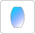

# Spherical lens

## Ports

`input_1`
: Input port.

`output_1`
: Light ouput. This port represents the light having passed the `rear` surface of the lens.

## Properties

`front curvature`
: Radius of curvature of the `front` surface. A positive value denotes a convex surface.

`rear curvature`
:Radius of curvature of the `rear` surface. A positive value denotes a concave surface.

`center thickness`
: Thickness of the lens center along the optical axis.

`refractive index`
: Refractive index of the (glass-) material. See [refractive index definition](../refractive_index.md).