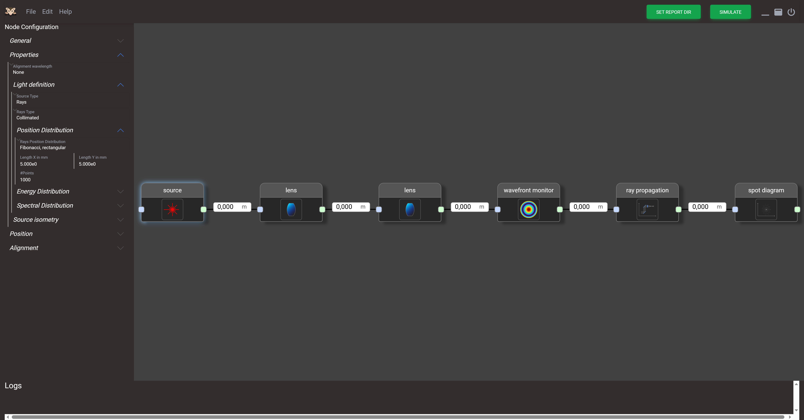

# opossum_gui

[](https://www.gnu.org/licenses/gpl-3.0)

> The graphical user interface for **OPOSSUM**, the **Open-source Optics Simulation System and Unified Modeler**,

## About

`opossum_gui` provides a graphical user interface for the `opossum_core`.
It is part of the OPOSSUM ecosystem, among the tools:

* **`opossum-core`**: The core Rust library for optical simulation.
* **`opossum-backend`**: A web API backend.
* **`opossum-clie`**: A command-line interface for analyzing models.

---

## ✨ Highlights

* Visual editor for optical systems (drag & drop nodes, connect elements)
* Open / validate **`.opm`** scene files, save changes, and export results
* Run analyses and generate reports into a chosen directory
* Integrated logging panel and status messages
* Cross-platform (Linux/Windows)¹

---

## 🧰 Requirements when building from source

* **Rust** (stable) with **Cargo**  
  Install from <https://rustup.rs>
* Install Dioxus CLI:

```bash
# to use pre-built binearies for dioxus cli
cargo install dioxus-cli
```

---

## 📦 Build & Run

### From the repository root (workspace)

```bash
# Clone
git clone https://github.com/opossum-labs/opossum.git
cd opossum

# Build the GUI package
cargo build --release

# Start the backend
cargo run -p opossum_backend

# Build & start the GUI
dx serve -p opossum_gui
```

### From an installer

Download latest installer from the offical [OPOSSUM repository](https://github.com/opossum-labs/opossum/releases).
Run the installer and open OPOSSUM.

## 🚀Usage

**Open an existing model**

* `File → OpenProject` and select an .opm file.
* The scene loads into the canvas; nodes and connections become editable.

**Create a new model**

* `File → New Project` to start with an empty canvas.
* Add optical components via `Edit → Add Node` 
* Connect the nodes at their ports
* Configure the nodes
* Add analyzers via `Edit → Add Analyzer `

**Save your model**

* `File → Save Project` stores the model as .opm.

**Run analysis & export reports**

* Set a report directory using the `SET REPORT DIR` button.
* Press the `SIMULATE` button to analyze the current model.
Reports are written to that directory (matching CLI behavior).

**Example view of the GUI**



## 🗂️File Format (.opm)

Opossum models are stored in .opm files.
The GUI reads/writes the same format used by opossum_core and the CLI, so files are interchangeable across tools.

## Any problems?

If you have any issues or feature requests, please do not hesitate to visit our [issue page](https://github.com/opossum-labs/opossum/issues) an open up new issues or to contact the maintainers of this repository.
