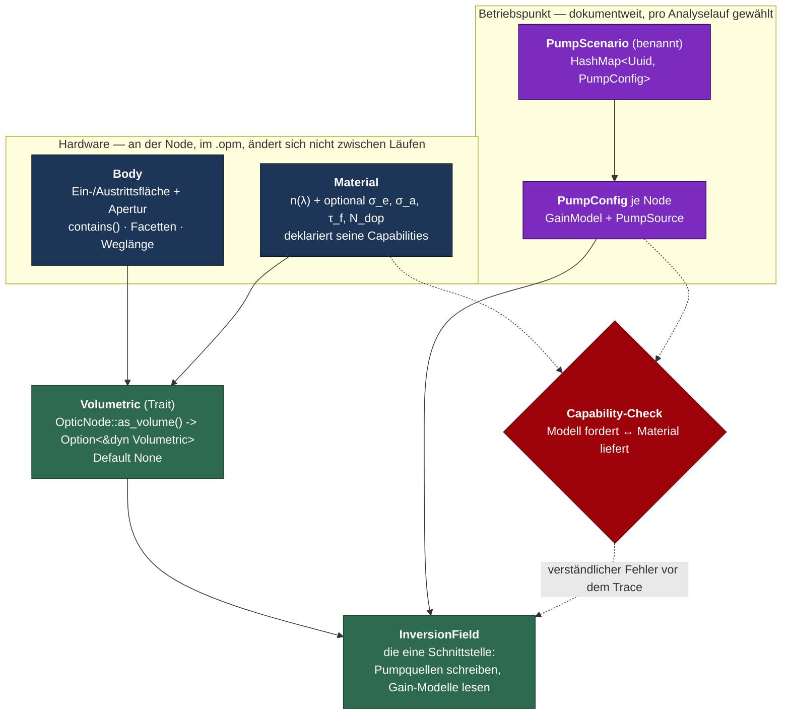

# Architektur der Verstärkungsmodellierung

Dieses Dokument steht **über** den Stufendokumenten: es legt die tragende Struktur fest, in der die
Eskalationsstufen aus [`UEBERSICHT.md`](UEBERSICHT.md) leben. Es ersetzt die Architekturentscheidungen
aus [`00_vorbereitung.md`](00_vorbereitung.md) (dort: Amp-Config als Node-Property); die
Physikstufen `02`–`05` und das [`00_fundament.md`](00_fundament.md) bleiben inhaltlich gültig und
wechseln nur ihren Träger.

---

## Kontext

Die bisherige Vorbereitung (V1–V6, Commits `383ba2fb`…`c5b8ddd9`) hat Verstärkung als **Node-Property**
`amp config` mit einem `GainModel`-Enum umgesetzt, getragen von Lens/Wedge/CylindricLens. Das trägt
die simpelste Stufe (`GainModel::Const`), stößt aber an vier Grenzen, sobald es echter wird:

1. **Wer darf verstärken, ist hartcodiert.** `AMP_CONFIG_NODE_TYPES: &[&str] = &["cylindric lens",
   "lens", "wedge"]` (`opossum_core/src/gain/mod.rs:42`) ist eine handgepflegte Stringliste, die das
   GUI in `scenery_editor/node/node_component.rs:52` konsumiert. Es gibt keinen Vertrag, den die
   Physik abfragen könnte.
2. **Es gibt kein Material.** Eine Suche über `opossum_core/src` findet keine einzige Struktur oder
   Trait namens `Material`/`Medium`. Das einzige Materialdatum ist die Property `refractive index`
   (`RefractiveIndexType`). Für σ_e, σ_a, τ_f, Dotierung existiert kein Platz.
3. **Es gibt keinen Körper.** Es existiert keine begrenzte Fläche und kein Volumen — nur unendliche
   `Plane`/`Sphere`/`Cylinder`/`Parabola`. `geometry/body/` ist ein **leeres Verzeichnis**;
   `cuboid.rs` und `optical_table.rs` liegen im Ordner, sind aber nicht in `geometry/mod.rs`
   eingebunden (toter SDF-Render-Code). Transversale Ausdehnung existiert nur als Port-`Aperture`.
   Damit hat das Inversionsfeld keine Domäne und die Pumpgeometrie keine Fläche.
4. **Betriebspunkt und Hardware liegen am selben Ort.** Ein Modell mit fünf Verstärkern in drei
   Pumpvarianten durchzurechnen bedeutet heute, das Modell zwischen den Läufen zu editieren.

Ziel ist die **tragende Struktur** — nicht die Physik.

---

## Was der Code schon mitbringt

| Fund | Bedeutung |
|---|---|
| **`SourcePort` + `source_map`** (`nodes/source_port/mod.rs`, `analyzers/energy.rs:29`) | Ein Node markiert nur die *Position*, die Definition liegt als `HashMap<Uuid, …>` im Analyzer-Config. Der Doc-Kommentar sagt wörtlich: *„the same source port can be used for different light sources in different analyses"*. Exakt das Muster für Pump-Szenarien — inkl. `prune_source_map`, Backend-Endpunkt `get_available_sources`, Karten-UI und Undo. |
| **`OpmDocument.analyzers: IndexMap<Uuid, AnalyzerInfo>`** (`opm_document.rs`) | Das Vorbild für eine zweite dokumentweite Liste; CRUD, Undo und der Identitätserhalt über `insert_analyzer` sind fertig. |
| **`render::SDF` + `SDFCollection`/`SDFOperation` + `ray_marching.rs`** | Ein vorhandener, ungenutzter CSG-Ansatz. `Lens` hat sogar ein auskommentiertes `impl SDF`. Startpunkt für begrenzte Körper, wenn analytische Formen nicht mehr reichen. |
| **`pass_through_volume_generic`** (`core_optics/optic_node_ext.rs:396`) | Die Naht ist schon gelegt: eine Stelle, an der „innen passiert etwas" eingehängt wird. |
| **Amp-Statuszeile + Übersichtspanel (V5/V6)** | Bleibt weitgehend verwendbar — es wird zum Szenario-Editor umgewidmet, nicht weggeworfen. |

**Harte Randbedingung 1:** Nodes liegen als `Arc<Mutex<dyn Analyzable>>` (`core_optics/optic_ref.rs:27`).
Ein `trait Amplifiable: Volumetric + Material` ist konstruierbar, aber vom Trait-Objekt aus **nicht
erreichbar** — er braucht einen Accessor mit Default auf `OpticNode`.

**Harte Randbedingung 2:** `Properties::update` (`properties/mod.rs:111`) setzt nur Properties, die
die Default-Node bereits kennt (`let _ = self.set(...)` schluckt den Fehler). Eine Property
umzubenennen lässt Altdateien also **still** auf den Default zurückfallen — Datenverlust ohne
Fehlermeldung. Jede Umbenennung braucht einen expliziten Migrationsschritt.

---

## Zielarchitektur

Fünf Schichten, jede mit genau einer Verantwortung. Die Trennlinie ist **Hardware ↔ Betriebspunkt**.



### Die vier tragenden Entscheidungen

| Frage | Entscheidung | Warum |
|---|---|---|
| **Wer darf verstärken?** | Trait-Accessor `OpticNode::as_volume(&self) -> Option<&dyn Volumetric>` mit Default `None`. `AMP_CONFIG_NODE_TYPES` entfällt und wird zur Laufzeit aus der Node-Registry berechnet. | Gibt der Physik einen echten Vertrag (Körper, Material, Ein-/Austrittsfläche) statt einer Stringliste, und die GUI-Gating-Liste kann nicht mehr driften. |
| **Wo lebt die Konfiguration?** | Aufgeteilt: **Body + Material an der Node**, **GainModel + PumpSource im Szenario**. `OpmDocument.pump_scenarios: IndexMap<Uuid, PumpScenario>`; `AnalyzerInfo` trägt `Vec<Uuid>` → ein Analyzer liefert N Reports. | Ein Modell, mehrere Pumpvarianten, ohne das Modell zu editieren. Nutzt die vorhandene `SourcePort`/`source_map`-Maschinerie. |
| **Wie koppelt eine Pumpquelle?** | Gestaffelt: konstante Inversion und analytische Profile **in der PumpConfig**; ein echter Pumplaser später als eigene Quelle mit eigener Optik, angekoppelt über **Facetten-Ports des Körpers**. Beide schreiben über dieselbe `InversionField`-Schnittstelle. | Die einfachen Fälle brauchen keine dynamischen Ports (V7). Die Facetten des Körpers definieren später, *wo* gepumpt wird — das macht das zurückgestellte V7 überhaupt erst wohldefiniert. |
| **Was markiert einen Verstärker?** | Die **Szenario-Zugehörigkeit**, nicht das Material. Auch eine Node mit Dummy-Material darf im Szenario „idealer Verstärker, Gain 2.34" sein. Sobald ein Modell spektroskopische Daten braucht, greift der **Capability-Check** mit einer klaren Meldung. | Schnelle Abschätzungen bleiben möglich, ohne überall Material nachzupflegen — und der Moment, in dem es nicht mehr reicht, wird explizit gemeldet statt still falsch gerechnet. |

### Der Capability-Check ist das modulare Rückgrat

```rust
// Was ein Material liefern kann
enum MaterialProperty { RefractiveIndex, EmissionCrossSection, AbsorptionCrossSection,
                        FluorescenceLifetime, DopantDensity }

impl Material  { fn provides(&self) -> &[MaterialProperty]; }
impl GainModel { fn requires(&self) -> &[MaterialProperty]; }
```

Vor `OpmDocument::analyze()` läuft eine Prüfung über alle (Node, Szenario)-Paare und wirft einen
`OpmResult`-Fehler, der Node, Modell, Material **und die fehlende Eigenschaft** benennt. Das ist die
konkrete, konsumierte Form der „Capability-Deklaration (minimal)" aus
[`00_fundament.md`](00_fundament.md) Punkt 5 — und die Stelle, an der jede spätere Eskalationsstufe
genau eine Zeile ergänzt, statt etwas umzubauen.

---

## Umsetzung

Reihenfolge = Commit-Reihenfolge. Jeder Schritt ist für sich lauffähig und testbar.

### M1 — `Material` als Träger (Core / GUI)

**Warum zuerst:** Ohne Materialbegriff hat weder die Spektroskopie noch der Capability-Check einen
Ort. Und die Property-Umbenennung ist der einzige Schritt mit `.opm`-Migrationsrisiko — er gehört an
den Anfang, solange wenige Dateien betroffen sind.

- **M1.1** Neues Modul `opossum_core::material`: `struct Material` kapselt zunächst **nur**
  `RefractiveIndexType` plus `MaterialProperty`/`provides()`. Keine spektroskopischen Felder — die
  kommen erst mit dem ersten Modell, das sie liest. Neue `Proptype::Material`-Variante mit
  `to_html`/`export_data`-Arm (`properties/proptype.rs:133` als Muster).
- **M1.2** Property `refractive index` → `material` in den drei Volumen-Nodes (`nodes/lens/mod.rs:89`,
  `nodes/wedge/mod.rs`, `nodes/cylindric_lens/mod.rs`) und den 13 Lesestellen (4 Dateien, u. a.
  `analyzers/raytrace.rs`).
  **Zwingend dazu:** ein Migrationshook in der Deserialisierung, der `refractive index` aus
  Altdateien nach `material` überträgt — ohne ihn fallen Altdateien wegen `Properties::update` still
  auf den Default (1.5 Sellmeier) zurück.
- **M1.3** GUI: Material-Editor, der den vorhandenen `refractive_index_editor/`-Teilbaum (6 Dateien,
  Const/Sellmeier/Schott/Conrady/Air) **unverändert wiederverwendet** und nur eine Ebene darüber legt.

**Test:** Roundtrip mit Alt-`.opm` (Index bleibt erhalten, nicht Default), Roundtrip neu, Regression
aller bestehenden Systeme, `volume_propagation_regression` in `nodes/lens/mod.rs` unverändert.

**Commit:** `Introduce a Material property replacing the bare refractive index`

---

### M2 — Begrenzte Körper als Domäne (Core)

**Warum:** Das Inversionsfeld braucht ein Volumen, die Pumpgeometrie eine Fläche. Beides existiert
nicht. Bewusst **ohne** Tracing gegen den Körper — der Zwei-Flächen-Durchgang bleibt unverändert,
damit die Verstärkung nicht von einem neuen Propagationsmodus blockiert wird.

- **M2.1** `geometry/body/` (das leere Verzeichnis) füllen: `trait Body` mit `contains(point)`,
  `facets() -> &[Facet]`, `bounding_box()`, `path_length_inside(ray)`. Dazu **genau eine** Impl
  `SurfaceBoundedBody`: begrenzt durch Eintritts- und Austrittsfläche (die vorhandenen
  `GeoSurface`-Typen `Plane`/`Sphere`/`Cylinder`/`Parabola`) plus die transversale Port-Apertur.
  Damit sind Scheibe (zwei `Plane` + `BinaryCircle`), Slab (zwei `Plane` + `BinaryRectangle`), Rod
  (dito mit großer Dicke), Linse und Wedge **derselbe** Körper mit anderen Parametern — keine
  benannten `Disk`/`Rod`/`Slab`-Typen, die niemand liest.
  Geschlossene Formeln bleiben es trotzdem: `path_length_inside` ist die Differenz der beiden
  ohnehin schon berechneten `calc_intersect_and_normal`-Treffer, `contains` ein Vorzeichentest gegen
  beide Flächen und die Apertur.
  **Zwingend dazu:** `GeoSurface` (`geometry/geo_surface.rs:19-46`) kennt heute nur den
  Strahlschnitt, keinen Seitentest. `contains()` braucht eine neue Methode „Punkt vor/hinter der
  Fläche" — für `Plane`/`Sphere` je zwei Zeilen.
  Der vorhandene `render::SDF` bleibt vorerst außen vor — er ist einheitenlos (`Point3<f64>`), an
  `Color` gekoppelt und über Sphere-Tracing nur näherungsweise; `Body` ist so geschnitten, dass ein
  SDF-Wrapper ihn später implementieren kann.
- **M2.2** Die drei vorhandenen Volumen-Nodes leiten ihren `Body` aus ihren bestehenden
  Geometrie-Properties ab (Krümmungen + Mitteldicke + Port-Apertur) — **keine** neue Benutzereingabe,
  kein `.opm`-Bruch.
- **M2.3 entfällt.** Ein eigener Node-Typ `BulkMedium` ist nicht nötig: Scheibe, Rod und Slab lassen
  sich aus Wedge bzw. Linse mit planaren Flächen, passender Mitteldicke und kreisförmiger oder
  rechteckiger Apertur zusammensetzen. `nodes/bulk_medium/` bleibt vorerst leer; ein dedizierter
  Node mit Formauswahl ist reiner Bedienkomfort und wird später ausgebaut, er blockiert die
  Verstärkung nicht.

**Explizites Nicht-Ziel dieser Stufe:** Mantelflächen-Tracing und Totalreflexion im Rod. Das ist ein
neuer Propagationsmodus (eine Schleife *innerhalb* einer Node), den die heutige sequentielle
Zwei-Flächen-Architektur nirgends kennt — größter Einzelposten, eigener Ausbau (siehe Ausblick).

**Commit:** `Add bounded bodies as the domain of a volume node`

---

### M3 — `Volumetric`-Trait statt hartcodierter Liste (Core / GUI)

**Warum genau hier:** Erst jetzt hat der Vertrag Inhalt (Body **und** Material existieren) — vorher
wäre er eine Abstraktion, die nichts liest.

- **M3.1** `trait Volumetric: OpticNode` mit `body()`, `material()`, `entry_surface()`,
  `exit_surface()`. Accessor `fn as_volume(&self) -> Option<&dyn Volumetric> { None }` (plus `_mut`)
  auf `OpticNode`; die drei Volumen-Node-Typen überschreiben mit `Some(self)`.
- **M3.2** `pass_through_volume_generic` liest Ein-/Austrittsfläche und Index künftig über den Trait
  statt über Argumente — dieselbe Naht, aber generisch aufrufbar.
- **M3.3** `AMP_CONFIG_NODE_TYPES` ersatzlos streichen. Die GUI-Liste entsteht zur Laufzeit aus der
  Node-Registry (der bestehende Test `amp_config_node_types_are_exhaustive` instanziiert bereits
  jeden registrierten Typ — dieselbe Schleife wird zur produktiven Funktion). Konsumenten:
  `components/context_menu/cx_menu.rs:32`, `scenery_editor/node/node_component.rs:52`.

**Commit:** `Derive volume capability from a trait instead of a hardcoded type list`

---

### M4 — Pump-Szenarien (Core / Backend / GUI)

**Warum:** Erst jetzt gibt es etwas, worauf ein Szenario zeigen kann. Dies ist der Schritt, der den
bestehenden `amp config`-Pfad ablöst.

- **M4.1** Core: `PumpConfig { gain_model: GainModel, pump: PumpSource }` und
  `PumpScenario { name: String, configs: HashMap<Uuid, PumpConfig> }`.
  `OpmDocument.pump_scenarios: IndexMap<Uuid, PumpScenario>` neben `analyzers` — inklusive
  `prune`-Funktion gegen gelöschte Nodes (Vorbild `EnergyConfig::prune_source_map`,
  `analyzers/energy.rs:52`).
- **M4.2** `AnalyzerInfo` bekommt `pump_scenarios: Vec<Uuid>`; `OpmDocument::analyze()` bekommt eine
  innere Schleife und liefert einen benannten Report pro Szenario. `clear_edges()`/`reset_data()`
  müssen **zwischen den Szenarien** laufen, nicht nur zwischen Analyzern.
- **M4.3** `MaterialProperty`-Capability-Check vor dem Trace, mit Node-, Modell- und Materialnamen im
  Fehlertext.
- **M4.4** **Ablösung des Altpfads:** `GainModel` wandert aus der Node-Property in die `PumpConfig`;
  die Property `amp config` und `gain::AMP_CONFIG` entfallen. Backend: `/nodes/amplifiers`
  (`opossum_backend/src/nodes/amplifiers.rs`) wird zu einem Szenario-Endpunkt. GUI: das
  Übersichtspanel (`node_editor/amp_overview.rs`) wird zum **Szenario-Editor**, die Statuszeile zeigt
  den Verstärkerstatus **des gewählten Szenarios**, der Kontextmenü-Toggle trägt eine Node ins aktive
  Szenario ein bzw. aus. Die V4–V6-Arbeit bleibt strukturell erhalten, nur die Datenquelle wechselt.

**Neu für die GUI:** der Begriff „aktives Szenario" (was die Canvas anzeigt). Beachte die bekannte
Falle aus [`00_vorbereitung.md`](00_vorbereitung.md) V6: `NODE_DETAILS_REFRESH` wird bei Add/Remove
nicht erhöht.

**Commits:** je einer für M4.1/M4.2, M4.3, M4.4-Core, M4.4-Backend, M4.4-GUI.

---

### M5 — `InversionField` als einzige Schnittstelle (Core)

**Warum:** Der Punkt, an dem die Modularität steht oder fällt. Alles, was Inversion *erzeugt*,
schreibt hinein; alles, was verstärkt, liest heraus. Erst danach beginnen die Physikstufen
([`02`](02_L0_small_signal_gain.md)–[`04`](04_L2_frantz_nodvik_spectral.md)) — jede ergänzt genau
eine `GainModel`-Variante plus ihre `requires()`-Zeile.

- **M5.1** `InversionField` über der `Body`-Domäne aus M2 (Diskretisierung entlang z + transversal).
- **M5.2** Erste Produzenten in `PumpSource`: `ConstInversion` und analytische Profile
  (Gauß/Supergauß/Beer-Lambert entlang einer Pumpachse).
- **M5.3** Konsument: Auswertung in `pass_through_volume_generic`, gespeist über den
  Ray-Energie-Mutator aus [`00_fundament.md`](00_fundament.md) (`Ray.e` ist privat, `light/ray.rs:44`
  — nur `filter_energy()` existiert und verbietet Faktoren > 1).

**Lackmustest der Modularität:** der [Pump-Solver](05_pump_solver.md) muss dieselbe Maschinerie mit
umgedrehtem Vorzeichen benutzen können, ohne M5 umzubauen.

---

### Ausblick — bewusst außerhalb dieses Plans

- **Echte Pumpquellen mit eigener Optik + Facetten-Ports.** Der Körper kennt seine Facetten, damit
  ist das zurückgestellte V7 ([`00_vorbereitung.md`](00_vorbereitung.md)) erstmals wohldefiniert. Die
  fünf dort aufgelisteten Lücken bleiben aber offen: kein `OpticPorts::remove()`, Property-Patch löst
  kein `update_surfaces()` aus, `cleanup_orphan_connections_and_mappings` ist privat,
  `port_map_cascade` deckt keine verschwindenden Ports ab, `DocumentChange` kennt keine
  Port-Änderung.
- **Volumen-Tracing mit Mantelfläche und Totalreflexion.** Neuer Propagationsmodus; Voraussetzung für
  ASE und realistisches Rod-Pumpen.
- **Dedizierter `BulkMedium`-Node** (`nodes/bulk_medium/`, heute leer). Reiner Bedienkomfort: eine
  Formauswahl Scheibe/Rod/Slab statt „Wedge mit planaren Flächen und passender Apertur". Erst
  sinnvoll, wenn `SurfaceBoundedBody` steht und sich zeigt, dass die Zusammensetzung von Hand stört.
- **Spektroskopische Materialdaten** — siehe Crate-Frage.

---

## Zur Crate-Frage

**Gain-Physik als eigenes Crate: nicht machbar, ohne den Workspace umzubauen.** `Proptype` und die
Node-Typen in `opossum_core` müssen die Gain-/Pump-Typen kennen, während der Gain-Code `Rays`, `Ray`,
`Isometry` und `OpticSurface` aus dem Core braucht — ein Zyklus. Auflösbar nur über ein zusätzliches
Basis-Crate (`opossum_optics_types`), das beide unter sich hätte. Das ist ein großer Umbau ohne
heutigen Nutzen; `opossum_core::gain` bleibt ein in sich geschlossener Modulbaum.

**Ein Crate lohnt sich wirklich: die spektroskopische Materialbibliothek.** Sie braucht nur `uom` und
`Length` — keine `Rays`, keinen Graphen. Die Abhängigkeit zeigt in genau eine Richtung
(`opossum_core` → Materialbibliothek), kein Zyklus. Das passt zu der Absprache aus
[`README.md`](README.md), dass ein Kollege parallel eine generische Materialbibliothek baut:
**dieser Plan definiert nur das Trait-Interface `Material`/`MaterialProperty` in M1**, die Bibliothek
implementiert es später. Bis dahin genügen wenige hartcodierte Presets hinter demselben Interface.

`geometry` wäre technisch ebenfalls abtrennbar (nur nalgebra + uom), aber das ist reine Umzugsarbeit
ohne Gewinn — nicht empfohlen.

---

## Was das für die bestehenden Dokumente bedeutet

[`00_vorbereitung.md`](00_vorbereitung.md) beschreibt V1–V6 mit einer anderen Semantik als hier
beschlossen (Property statt Szenario) — ebenso Abschnitt 2 von [`UEBERSICHT.md`](UEBERSICHT.md).
Beide müssen nach M4 nachgezogen werden; das ist laut Projektregel („Docs sync") ein **eigener
Planungsschritt**, nicht Teil der Code-Commits. Inhaltlich unverändert gültig bleiben
[`00_fundament.md`](00_fundament.md) (Ray-Energie-Mutator, Gruppenlaufzeit, Diagnostik-Slot) sowie
[`02`](02_L0_small_signal_gain.md)–[`05`](05_pump_solver.md), die nur ihren Träger wechseln.

---

## Verifikation

**Pro Schritt (immer):** `cargo test`, dann `cargo fmt`, dann
`cargo clippy -- -D warnings -W clippy::pedantic -W clippy::nursery -W rust-2018-idioms`.

**M1:** Ein Alt-`.opm` mit `refractive index` laden und speichern — der Index muss erhalten bleiben
und darf **nicht** auf den Sellmeier-Default zurückfallen (Regressionstest, der ohne den
Migrationshook fehlschlägt). `volume_propagation_regression` in `nodes/lens/mod.rs` unverändert.

**M2:** Unit-Tests für `contains()`/`path_length_inside()` gegen analytisch bekannte Werte, gebaut
aus den vorhandenen Nodes: Scheibe und Slab als Wedge mit planaren Flächen und kreisförmiger bzw.
rechteckiger Apertur, gekrümmter Fall als Linse. Zusätzlich ein Test, dass `path_length_inside` mit
der Weglänge übereinstimmt, die der bestehende Zwei-Flächen-Durchgang liefert.

**M3:** Ein Test, der über `node_types()` iteriert und prüft, dass genau die drei Volumen-Typen
`as_volume().is_some()` liefern — der Ersatz für den heutigen `amp_config_node_types_are_exhaustive`.

**M4:** Core-Test: ein Dokument mit zwei Szenarien liefert aus einem Analyzer zwei Reports mit
unterschiedlichem Ergebnis. Capability-Test: ein Modell, das σ_e fordert, auf einem Material ohne σ_e
ergibt einen Fehler, der Node-, Modell- und Materialnamen enthält. Backend-Test: Undo eines
Szenario-Patches dreht ihn zurück (Vorbild: der vorhandene Test in
`opossum_backend/src/nodes/amplifiers.rs`).

**M5:** Energiebilanz — die dem Feld entnommene Energie entspricht dem Zuwachs im Strahl.
Verstärkung mit leerem Inversionsfeld ist ein reiner Durchgang.

**GUI (M1.3, M3.3, M4.4):** in der laufenden GUI prüfen (`cd opossum_gui && dx serve`, Backend
parallel) — GUI-Tests existieren in diesem Crate praktisch nicht. Konkret: Material-Editor zeigt die
bisherigen Index-Modelle unverändert; der Verstärker-Eintrag erscheint nur bei Volumen-Nodes;
Szenario-Wechsel aktualisiert Statuszeilen ohne Kantenversatz; Undo/Redo dreht Szenario **und**
Canvas-Marker zurück.

**Durchgehend:** Nach M1–M4 muss jedes bestehende Testsystem physikalisch **unverändert** rechnen —
solange kein Szenario zugeordnet ist, ist alles passiv.
