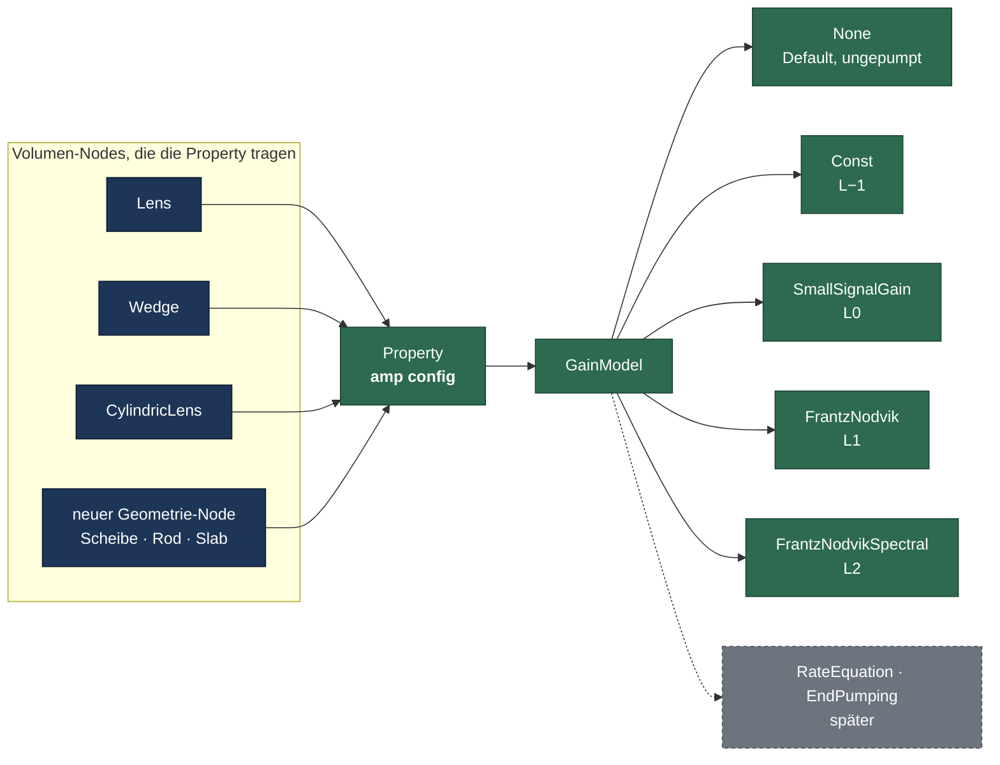
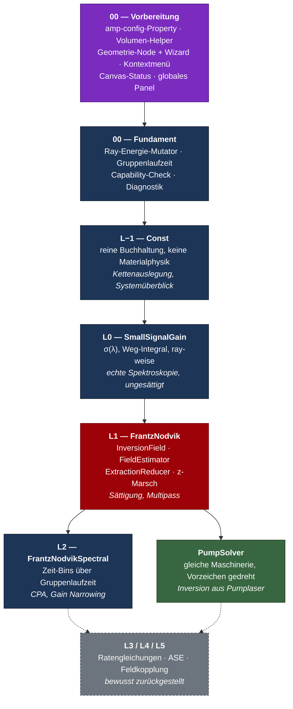
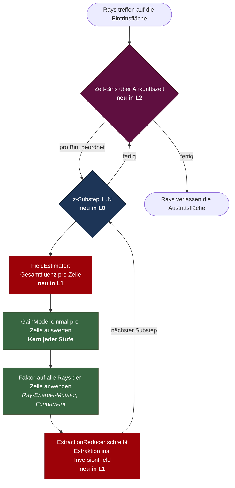

# Verstärkung in OPOSSUM — Gesamtübersicht

Diese Datei ist der Einstiegspunkt: sie erklärt in einem Rutsch, **was gebaut wird, in welcher
Reihenfolge, und warum jede Stufe klein bleibt**. Die Detailpläne pro Stufe liegen daneben
(`00_fundament.md` … `06_L3_L4_L5_outlook.md`), die physikalischen Grundideen im Root-Dokument
[`../plan_verstaerkung.md`](../plan_verstaerkung.md).

---

## 1. Worum es geht

OPOSSUM kann heute Licht durch passive Optik propagieren — Linsen, Spiegel, Filter, Gitter. Was
fehlt, ist ein **aktives Medium**: ein Bauteil, das dem Strahl Energie *hinzufügt*, aus einer
gespeicherten Inversion, die dabei aufgebraucht wird.

Das ist kein einzelnes Feature, sondern eine Kette von immer physikalischeren Modellen, plus die
Infrastruktur, um sie überhaupt anlegen und bedienen zu können. Der Plan baut das in sieben
Schritten auf, wobei **jeder Schritt für sich ein funktionierender, testbarer Zustand ist** — und
jeder Schritt nur eine Schicht auf den vorherigen legt, statt ein neues Parallelsystem
aufzumachen.

---

## 2. Die Leitidee: ein wachsendes Modell-Enum, getragen als Property

Der zentrale Kniff, der verhindert, dass jede Eskalationsstufe ein eigenes Ökosystem braucht:

> Verstärkung ist **kein eigener Node-Typ**, sondern eine Property `amp config`, die jede Node mit
> einem Volumen trägt. Ihr Wert ist ein `GainModel`-Enum, das mit jeder Eskalationsstufe **eine
> Variante** dazubekommt — plus die Core-Bausteine, die genau diese Variante neu benötigt. Nichts
> wird ersetzt.

Das ist kein erfundenes Muster, sondern eines, das der Code bereits an zwei Stellen vorlebt:
`RefractiveIndexType` (Const / Sellmeier1 / Schott / Conrady / Air) und `FilterTypeBuilder`
(Constant / Spectrum). Beide werden von Backend und GUI bereits generisch behandelt — ein
Dropdown plus ein kleiner Editor pro Variante.

Dass die Property und nicht ein Node-Typ der Träger ist, hat zwei praktische Folgen: eine
bestehende Linse lässt sich per **normalem Property-Patch** zum Verstärker machen („as amplifier"),
ohne die Node zu ersetzen — und die Gain-Physik wird **einmal** in einem gemeinsamen
Volumen-Helper implementiert statt pro Node-Typ. Ideal- und Detektor-Nodes bekommen die Property
gar nicht erst und können damit nicht verstärken.

---

## 3. Aufbaureihenfolge

Die beiden `00`-Stufen sind reine Infrastruktur ohne Physik: **Vorbereitung** (violett) legt fest,
wie ein Verstärker repräsentiert und bedient wird, **Fundament** legt die physikalischen Träger
nach. `L2` und `PumpSolver` hängen **beide nur an L1**, nicht aneinander — sie können in
beliebiger Reihenfolge oder parallel angegangen werden. Rot markiert ist die einzige
Eskalationsstufe mit wirklich großem Core-Aufwand.

---

## 4. Was der Code schon mitbringt

Die Architektur-Recherche hat vier Dinge gefunden, die den Plan deutlich kleiner machen, als er
auf dem Papier aussieht:

| Bereits vorhanden | Bedeutung für den Plan |
|---|---|
| `Rays::total_energy()` | Die absolute Bundle-Energie, ohne die kein sättigendes Modell funktioniert, ist schon abrufbar. Teil A.6 „energy_weight" ist faktisch erfüllt. |
| `Rays::calc_fluence_at_position(iso)` | Die Voronoi-Fluenzschätzung ist **bereits ebenenunabhängig implementiert** — sie wird nur derzeit nirgends produktiv aufgerufen, nur in Unit-Tests. Phase 5 des Root-Plans ist damit „anschließen" statt „bauen". |
| `NodeReference` | Multipass-Verstärker brauchen **keine** neue Infrastruktur. Der Proxy-Node teilt sich über `Arc<Mutex<..>>` denselben Zustand mit dem echten Node — genau die Pointer-Semantik, die Teil A.7 verlangt. |
| Generisches `Proptype` + GUI-Editoren | Neue Nodes tauchen automatisch im Menü auf; Zahlen-/Längen-Properties bekommen automatisch ein Formular; Enum-Auswahl ist ein etabliertes Muster. |

Und vier Dinge, die es **nicht** gibt und die deshalb echten Neubau bedeuten:

| Fehlt komplett | Konsequenz |
|---|---|
| Jede Form von Gain-/Sättigungs-/Inversions-Physik | Kompletter Neubau. Der einzige Nachbar, `IdealFilter`, *verbietet* Transmission > 1 sogar explizit. |
| Volumen-/z-Marsch-Propagation | Dicke Bauteile machen heute einen einzigen Sprung Eintritts- → Austrittsfläche. Die Substep-Schleife entsteht in L0 und wird in L1 erweitert. |
| Ein `Material`-Konzept jenseits von n(λ) | Es gibt keinen Platz für σ_e, σ_a, τ_f. Deshalb hartcodierte Presets hinter einer schmalen Schnittstelle (siehe Abschnitt 7). |
| Gruppenindex / dn/dλ / Chirp | Für die Gruppenlaufzeit muss `DispersionFormula` um eine analytische Ableitung erweitert werden. |

Dazu eine kleine, aber unvermeidliche Stelle: `Ray.e` (die Energie) ist ein **privates Feld ohne
Setter**. Jede Verstärkung braucht deshalb eine neue Mutator-Methode direkt in `light/ray.rs` —
das lässt sich nicht von außen aus einer neuen Node-Datei erledigen.

---

## 5. Was zur Laufzeit passiert

Dieses Diagramm zeigt den vollen Ablauf innerhalb der Node beim Ray-Tracing — und in welcher
Stufe jeder Schritt dazukommt. Es ist die kompakteste Antwort auf „ist das wirklich modular?":
**jede Stufe fügt einen Ring hinzu, keine Stufe verändert einen inneren Ring.**

Bei **L−1** ist von diesem Bild nur die Mitte aktiv: ein Faktor, einmal angewendet, kein Substep,
kein Estimator, kein Feld. Bei **L0** kommt die Substep-Schleife dazu, aber ohne Estimator — jeder
Ray wird unabhängig behandelt. Erst **L1** koppelt die Rays über die Zelle, weil Sättigung genau
das erzwingt (Teil A.4: sonst extrahieren gleichzeitige Rays in Summe mehr Energie als vorhanden).
**L2** legt die Zeit-Bin-Schleife außen herum.

Der `PumpSolver` benutzt exakt dasselbe Bild — nur dass sein Modell Energie **deponiert** statt
sie zu entziehen. Wenn das am Ende nicht ohne Umbau funktioniert, war L1 zu eng an „Extraktion"
gebaut; das ist der eingebaute Lackmustest für die Modularität.

---

## 6. Aufwandsverteilung

| Stufe | Core | Backend | GUI |
|---|---|---|---|
| 00 Vorbereitung | mittel — Property-Träger, Volumen-Helper, Geometrie-Node | **klein** — ein Sammel-Endpunkt (+ Refactor zweier Sammler in einen) | **groß** — Wizard, Kontextmenü, Canvas-Status, Sidebar-Umschalter, globales Panel |
| 00 Fundament | **mittel** — Ray-Feld, Dispersionsableitung, Energie-Mutator | keine | keine |
| L−1 Const | klein — ein Faktor, ein Deckel | keine | ein Formular mit ~5 Zahlenfeldern |
| L0 SmallSignalGain | mittel — Substep-Schleife, σ(λ)-Schnittstelle, hartcodierte Presets | keine | ein Preset-Dropdown, meist read-only |
| L1 FrantzNodvik | **groß** — InversionField, FieldEstimator, ExtractionReducer, Energiebilanz | keine | zwei Dropdowns |
| L2 FrantzNodvikSpectral | mittel — Zeit-Binning über bestehende L1-Kette | keine | ein Dropdown, ein Zahlenfeld |
| PumpSolver | klein–mittel — Spiegelbild von L1 | keine | ein Dropdown, ein paar Zahlenfelder |

Zwei Schwerpunkte also, und sie liegen in verschiedenen Crates: die **Bedienoberfläche** steckt
fast vollständig in der Vorbereitungsstufe, die **Physik** fast vollständig in L1. Dazwischen ist
fast alles billig, und nach L1 ist fast alles Wiederverwendung.

Nicht in der Tabelle, weil bewusst zurückgestellt: **dynamische Ports** für `EndPumping`. Das wäre
der einzige Posten, der eine node-lokale Property-Änderung in eine graphweite strukturelle
Mutation verwandelt — mit fünf fehlenden Bausteinen quer durch Core, Backend und GUI (siehe
[`00_vorbereitung.md`](00_vorbereitung.md), V7).

---

## 7. Bewusste Abgrenzungen

- **Keine Materialbibliothek.** Ein Kollege baut die parallel. Bis dahin: wenige hartcodierte
  Presets (Yb:YAG, Nd:Glas) mit geschlossenen Formeln statt Tabellen, hinter einer schmalen
  Trait-Schnittstelle. Wenn die Bibliothek fertig ist, implementiert sie nur diese Schnittstelle —
  L0 bis L2 bleiben unangetastet. Nebeneffekt: der Plan braucht nirgends einen Tabellen- oder
  Kurven-Editor im GUI, für den es bisher **keinen** Präzedenzfall gibt.
- **Capability-Verhandlung bleibt minimal.** Teil A.6 beschreibt ein Verhandlungssystem; im Code
  existiert dafür keinerlei Grundlage (nicht einmal eine Analyzer-Kompatibilitätsprüfung). Gebaut
  wird deshalb nur eine schlanke Prüffunktion, die vor dem Trace einen verständlichen Fehler
  wirft — kein Registry-System. Sie wird erst in L2 wirklich scharf.
- **Gruppenlaufzeit kommt trotzdem ins Fundament.** Architektonisch wäre sie erst ab L2 nötig.
  Sie wird bewusst früher gebaut, weil ein neues Feld auf `Ray` später invasiver nachzurüsten
  wäre, wenn schon mehrere Gain-Modelle davon abhängen.
- **Dynamische Ports bleiben draußen.** `EndPumping` soll je Facette einen Pump-Port erzeugen.
  Ports *hinzufügen* wäre fast gratis (Ports entstehen ohnehin aus `update_surfaces()`), aber es
  gibt kein `OpticPorts::remove()`, ein Property-Patch löst gar kein `update_surfaces()` aus, die
  Aufräum-Kaskade für verwaiste Verbindungen ist privat und läuft nur beim Löschen einer Node, und
  das Wire-Protokoll kennt keine Port-Änderung. Eigenes Teilprojekt, siehe
  [`00_vorbereitung.md`](00_vorbereitung.md) V7.
- **L3 bis L5 sind Ausblick, kein Plan.** Ratengleichungen, ASE und Feldkopplung sind im
  Root-Dokument (Teil D) begründet zurückgestellt und bekommen erst dann ein eigenes Dokument,
  wenn sie konkret anstehen — auf Basis einer dann frischen Architektur-Recherche.

---

## 8. Arbeitsweise

Für jede Stufe gelten die Regeln aus Teil B des Root-Dokuments. Die zwei wichtigsten in der
Praxis:

1. **Erst analysieren, dann vorschlagen, dann implementieren** — jede Stufe beginnt mit einer
   Ist-Aufnahme der betroffenen Stellen, nicht mit Code.
2. **Regression zuerst** — vor der ersten Änderung muss ein Referenzergebnis eines bestehenden
   Systems festgehalten sein, das sich nach jeder Stufe reproduzieren lassen muss.

Und, spezifisch für dieses Repo: jede Stufe endet mit grünen Tests inklusive der bestehenden
(`cargo test`), und die physikalischen Abnahmekriterien aus dem jeweiligen Stufen-Dokument sind
Teil der Definition of Done — nicht optional.
